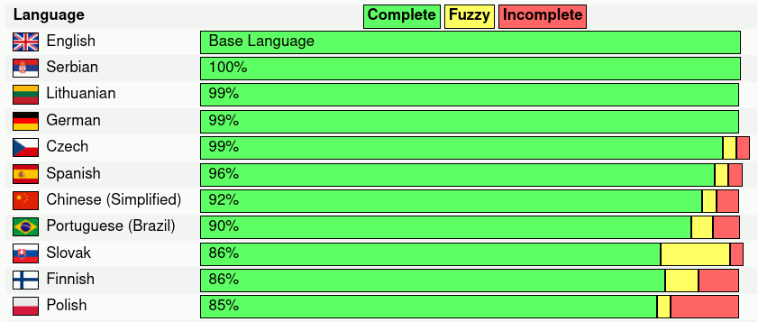

# Translation Helper Scripts

These scripts automate the process of updating the [Translation Leaderboard](https://neomutt.org/translate).

They take the `.po` files in the [NeoMutt repo](https://github.com/neomutt/neomutt),
check them for any syntax errors, generate a webpage, then upload the webpage to
the [website repo](https://github.com/neomutt/neomutt.github.io).

## Scripts

| Script                                     | Description                                         |
| :----------------------------------------- | :-------------------------------------------------- |
| [commit.sh](commit.sh)                     | Commit the updated webpage                          |
| [generate-webpage.sh](generate-webpage.sh) | Generate the Leaderboard webpage                    |
| [post-team.sh](post-team.sh)               | Post a message to the Translators' Discussion Board |
| [stats.sh](stats.sh)                       | Validate translations and print some stats          |

## Screenshot

The result looks a bit like this:

